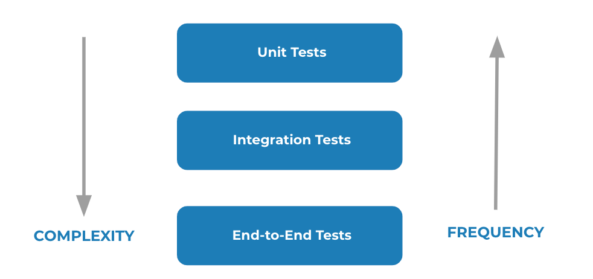

# Testing

### Different Types of Tests
- **Unit Tests**: Unit tests are the easiest tests to write because you can expect specific results for your input. There are no dependencies or complex interactions.
- **Integration** Tests: Integration tests are more complex than unit tests because you have to deal with dependencies.
- **End-To-End Tests**: End-to-end tests simulate a specific user interaction flow with your app. For example, clicking or entering text.

https://microsoft.github.io/code-with-engineering-playbook/automated-testing/e2e-testing/testing-comparison/

### How to create a test?

1. Select a testing framework that aligns with your programming language and technology stack. Popular ones include JUnit for Java, PyTest for Python, Mocha for JavaScript, etc.
1. Familiarize yourself with different types of tests, including unit tests, integration tests, and end-to-end tests. Each type serves a specific purpose in validating different aspects of your software.
1. Identify Critical Functionality: Identify critical functions and features in your software that should be thoroughly tested. Focus on areas with complex logic, user inputs, or potential failure points.
1. Write Unit Tests: Start with unit tests to validate individual components or functions. These tests should be isolated and focus on a specific piece of functionality. Mock external dependencies if necessary; Write Integration Tests: Build integration tests to check the interaction between different components/modules. Ensure that various parts of your software work well together.
1. Write End-to-End Tests: Develop end-to-end tests that simulate user interactions with your software. These tests should cover entire workflows and help identify issues that might arise in a real-world scenario.
1. Implement Test Data: Create test data that represents different scenarios and edge cases. This helps ensure your tests cover a broad range of situations.
1. Automate the Testing Process: Integrate your tests into your development workflow. This could include running tests automatically when code is pushed to a repository, using continuous integration (CI) tools like Jenkins, Travis CI, or GitHub Actions.

